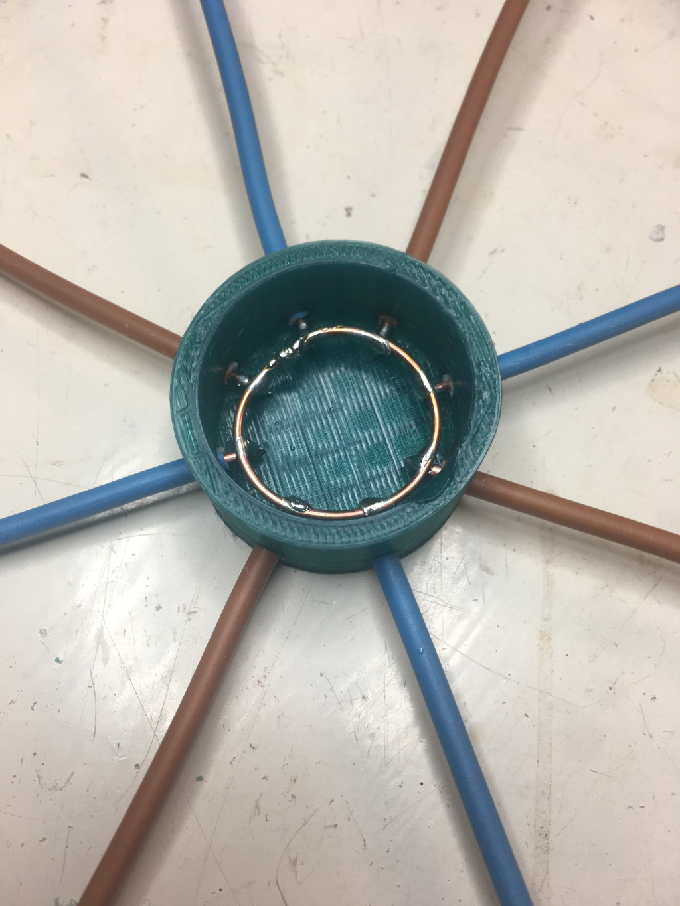

Title: building a discone antenna
Author: Ian Mortimer
Date: 2016-12-02
Tags: sdr, 3dprinting 
Category: SDR

After purchasing an SDR dongle ([NooElec NESDR SMArt](https://www.amazon.co.uk/NooElec-NESDR-SMArt-Enclosure-R820T2-Based/dp/B01GDN1T4S/ref=sr_1_1?ie=UTF8&qid=1480695130&sr=8-1&keywords=nooelec+smart)) and plugging in the stock antenna I managed to pick up a few transmissions, mostly the local taxi rank chattering about traffic and what sounded like a few planes relaying flight information but they were all very quiet and hard to distinguish so an antenna upgrade seemed to be the next logical thing to do.

After some research and wanting to keep the antenna as general purpose as possible at the moment (ideally you want an antenna tuned to the specific band you're interested in) I decided to have a crack at building a [discone antenna](https://en.wikipedia.org/wiki/Discone_antenna).

Looking at a few samples of commercial antennas on the market I decided the best thing to do would be to fabricate a mounting mechanism to support the "cone" and "disc" wires using my 3D printer.

The STL files for these are [here](img/discone_cone.stl) and [here](img/discone_disc.stl)

For the actual disc and cone, I used 2.5mmsq "twin and earth" cable - a solid copper core cable used in the UK for high current house wirings that looks like this:

Using this [handy calculator](http://www.changpuak.ch/electronics/calc_11.php) I measured up for a 100MHz and upwards antenna and cut all the peices to size (stripping of the outer protective covering but leaving the inner cores sheathed).

I ended up with 8 lengths of 831mm wire for the cone and 8 lengths of 300mm wire for the disc.

Once printed, I assembled the pieces and with a little help from the guys over on [##rtlsdr](http://irc.netsplit.de/channels/details.php?room=%23%23rtlsdr&net=freenode) got the correct connection for the coax to cone / disc arrangements (sheild of coax to cone, center connector to the disc)

The other end of the coax is a standard SMA connector and after feeding it through an old piece of plastic tubing I had lying around to act as a mounting pole, I mounted this in my attic using a small bracket

The results are not bad.

Total cost was about £20 including the twin and earth, 5m coax and a crimp SMA connector.

Here's a shot of the cone assembled and soldered up:

And here's the disc assembly:

Here's the final thing:

Now for the test:

Here's a shot from the stock antenna vs the discone antenna in GQRX.

Interesting results.